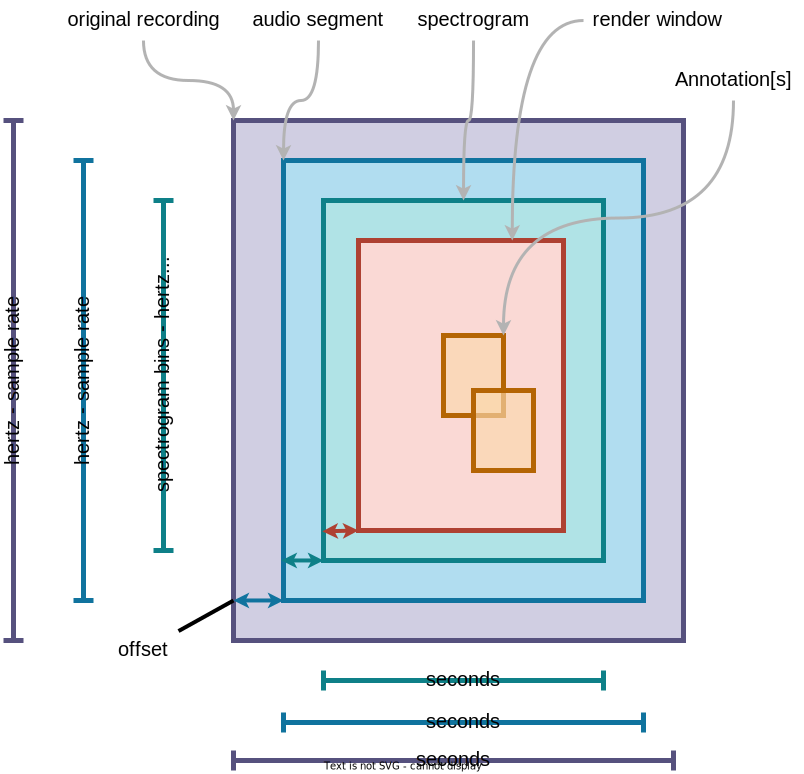

# Concepts

To render a spectrogram we're essentially showing a slice of the audio data 
with various transforms applied.

## The original recording

A recording. We'd like to know as little about this recording as possible.

## A segment of a recording

## A FFT transform (the spectrogram)

## A render window

## Other decorations (annotations)

Other decorations are drawn on top of the render window.

They will not be drawn on the spectrogram itself.

