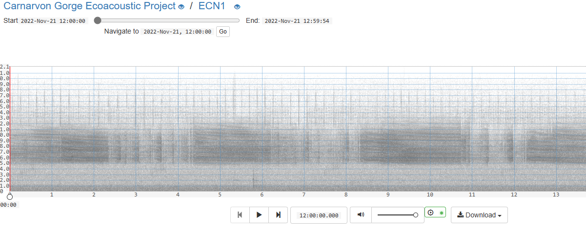

# Designs

We believe that a series of well made components can satisfy the requirements of
a number of UI layouts and designs.

## Search result grid

### Reference Image


### Notes

- grid of spectrograms and media controls
- additional selection component (out of spec?) overlaid

```html
<div>
    <div>
        <!-- TODO: these are snippets, how do supply coordinates?> -->
        <oe-spectrogram segment-offset="30" id="abc">
            <source src="https://api.acousticobservatory.org/audio_recordings/123.wav">
        </oe-spectrogram>
        <oe-media-controls style="top:0, right:0" for="abc">
        </oe-media-controls>
    </div>
    <!-- OR -->
    <div>
        <oe-spectrogram segment-offset="30" >
            <source src="https://api.acousticobservatory.org/audio_recordings/123.wav">
            <div slot="overlay">
                <oe-media-controls style="top:0, right:0"></oe-media-controls>
                <div style="top:0, right:0"><input type="checked"/></div>
            </div>
        </oe-spectrogram>
    </div>
    <!-- repeat 24 times -->
</div>
```

## Library


### Notes

- grid of spectrograms
- axes, grid lines, labels

```html
<div>
    <div>
        <oe-annotations readonly="true">
            <oe-axes>
                <oe-spectrogram id="abc">
                    <source src="https://api.acousticobservatory.org/audio_recordings/123.wav">
                </oe-spectrogram>
            </oe-axes>
            <oe-annotation start-seconds="7200" end-seconds="10800" low-frequency="1000" high-frequency="7000" >
                <oe-tag>Koala</oe-tag>
                <oe-tag>Phascolarctos cinereus</oe-tag>
                <oe-tag>Male</oe-tag>
            </oe-annotation>
        </oe-annotations>
        <oe-media-controls for="abc"></oe-media-controls>
        <!-- other metadata templated by the host framework -->
    </div>
    <!-- repeat 24 times -->
</div>
```

## Listen



### Notes

- Single spectrogram component
- axes, grid lines, labels,
- Spectrogram paging: Where the spectrogram window is scrolled along a audio segment
- Audio segment paging: Where audio segments are paged

```html
<div>
    <oe-annotations>
        <oe-axes>
            <oe-spectrogram segment-offset="30" original-duration="76200" window="33,1000,36,10000" >
                <source src="https://api.acousticobservatory.org/audio_recordings/123.wav">
            </oe-spectrogram>
            <oe-indicator></oe-indicator>
        </oe-axes>
    </oe-annotations>
    <!-- media controls may have zoom controls, spectrogram settings, etc... -->
    <oe-media-controls for="abc"></oe-media-controls>
</div>
```
